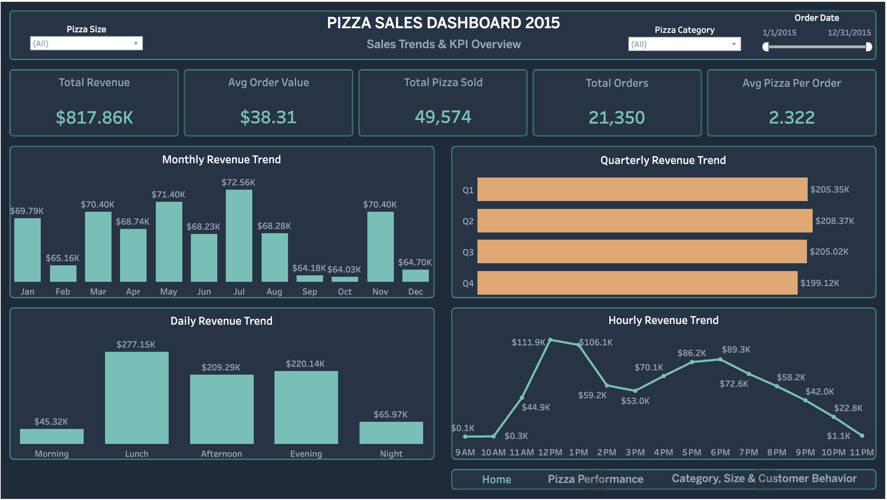
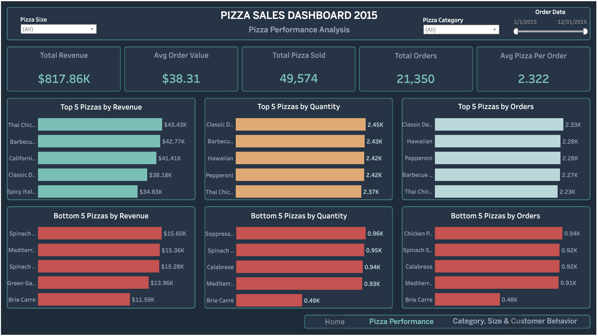
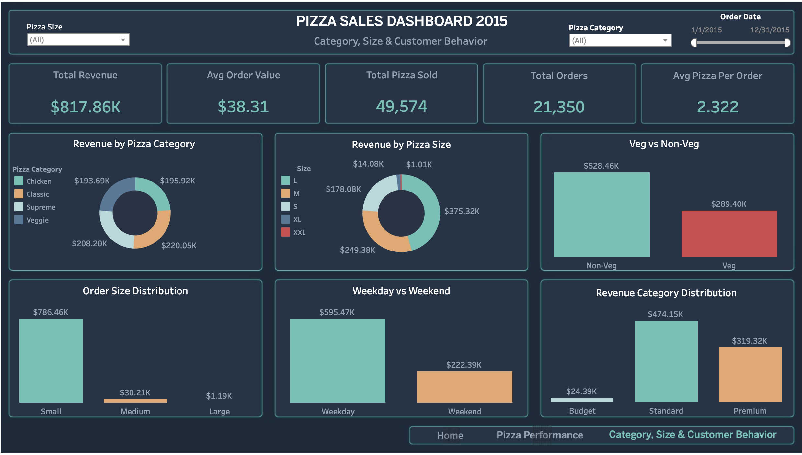

# 🍕 Pizza Sales Analysis 2015 — End-to-End Data Analytics Project

A complete end-to-end Data Analytics project analyzing pizza sales data through the full analytics pipeline — from raw data extraction to interactive dashboards and a detailed report.


<p align="center">
  
</p>

---

## 🎯 Project Objectives

* **Data Extraction:** Query and aggregate raw sales data using SQL.
* **Data Cleaning & Engineering:** Clean data and engineer new features using Python.
* **Exploratory Data Analysis:** Perform Univariate, Bivariate, and Correlation analysis.
* **Dashboard Development:** Build interactive dashboards in Excel and Tableau.
* **Business Insights:** Answer key business questions and provide actionable recommendations.

---

## 🧠 Dataset Overview

The dataset contains pizza sales transactions with **12 original features** and **8 engineered features**, capturing detailed order information across the full year of 2015.

* **Rows:** 48,620
* **Time Period:** January — December 2015

---

## 🛠️ Tools & Technologies

* **SQL (MySQL)** — Data extraction, aggregation & KPI calculation
* **Python (Pandas, NumPy, Matplotlib, Seaborn)** — Data cleaning, feature engineering & EDA
* **Microsoft Excel** — Pivot Tables, Charts, Timeline Slicer & Dashboard
* **Tableau Public** — Interactive multi-page dashboard

---

## 🗃️ Dataset Columns

### Original Columns

| Column | Data Type | Description |
|---|---|---|
| `pizza_id` | int | Unique pizza record identifier |
| `order_id` | int | Unique order identifier |
| `pizza_name_id` | text | Short code/slug for the pizza |
| `quantity` | int | Number of pizzas ordered |
| `order_date` | date | Date of the order |
| `order_time` | time | Time of the order |
| `unit_price` | double | Price per pizza |
| `total_price` | double | Total price for the order |
| `pizza_size` | text | Size (S, M, L, XL, XXL) |
| `pizza_category` | text | Category (Classic, Supreme, Veggie, Chicken) |
| `pizza_ingredients` | text | List of ingredients |
| `pizza_name` | text | Full name of the pizza |

### Engineered Columns

| Column | Data Type | Description |
|---|---|---|
| `day_of_week` | text | Day of the week (Monday–Sunday) |
| `is_weekend` | text | Weekend or Weekday |
| `month_name` | text | Month name (January–December) |
| `quarter` | text | Quarter (Q1–Q4) |
| `time_of_day` | text | Morning / Lunch / Afternoon / Evening / Night |
| `is_vegetarian` | text | Veg or Non-Veg (based on ingredients) |
| `order_size` | text | Small / Medium / Large (based on quantity) |
| `revenue_category` | text | Budget / Standard / Premium (based on unit price) |

---

## 🧹 Data Cleaning & Feature Engineering (Python)

1. **Data Type Fixing** — Converted `order_date` and `order_time` to proper formats
2. **Column Standardization** — Stripped and title-cased text columns
3. **Feature Engineering:**
   * `time_of_day` — Grouped order hours into 5 time segments
   * `day_of_week` — Extracted day name from order date
   * `is_weekend` — Classified Weekend vs Weekday
   * `month_name` — Extracted month name from order date
   * `quarter` — Extracted quarter from order date
   * `is_vegetarian` — Classified Veg/Non-Veg based on ingredients
   * `order_size` — Classified order size based on quantity
   * `revenue_category` — Classified Budget/Standard/Premium based on unit price

---

## 🔍 Exploratory Data Analysis (Python)

### Univariate Analysis
* Distribution of `total_price`, `unit_price`, `quantity`
* Value counts of `pizza_category`, `pizza_size`, `time_of_day`, `day_of_week`
* Distribution of `is_weekend`, `is_vegetarian`, `order_size`, `revenue_category`

### Bivariate Analysis
* Revenue, Quantity & Orders by Pizza Category
* Revenue, Quantity & Orders by Pizza Size
* Revenue, Quantity & Orders by Day of Week
* Revenue, Quantity & Orders by Time of Day
* Weekday vs Weekend comparison
* Veg vs Non-Veg comparison
* Monthly & Quarterly revenue trends
* Top 5 & Bottom 5 pizzas by Revenue, Quantity & Orders

### Correlation Analysis
* Heatmap — `quantity`, `unit_price`, `total_price`

---

## 📊 Dashboards

### Excel Dashboard


---

## 📋 Tableau Dashboard

### Dashboard 1 — Overview


### Dashboard 2 — Risk Analysis


### Dashboard 3 — Borrower Profile


🔗 **View Live Dashboard:** [Click Here to View on Tableau Public](https://public.tableau.com/app/profile/mehedi.hasan2176/viz/PIZZASALESDASHBOARD2015/Home)

---

## 📈 Key Insights

* 💰 **Revenue:** Total revenue of **$817,860** from **21,350 unique orders**
* 🍕 **Top Category:** Classic pizzas lead with the highest revenue & quantity
* 📏 **Top Size:** Large pizzas dominate with **45.89%** of total revenue
* 📅 **Peak Days:** Orders are highest on **Thursday–Saturday**
* ⏰ **Peak Hours:** Busiest times are **12–2 PM (Lunch)** and **6–8 PM (Evening)**
* 🏆 **Best Seller:** Thai Chicken Pizza — highest revenue ($43,434)
* 📉 **Worst Seller:** Brie Carre Pizza — lowest across all metrics
* 🥩 **Non-Veg dominates:** 64.6% of total revenue vs 35.4% Veg
* 📆 **Stable demand:** Monthly revenue consistent between $64K–$72K

---

## 📌 Business Recommendations

1. **Staffing:** Increase staff on Thursday–Saturday and during Lunch & Evening hours
2. **Promotions:** Focus marketing on Large size and Classic category pizzas
3. **Menu Review:** Consider removing or revamping Brie Carre Pizza
4. **Chicken Category:** Expand Chicken pizza variants — 3 of top 5 revenue pizzas are Chicken
5. **Q4 Recovery:** Run seasonal promotions in October–December to address Q4 dip
6. **Morning & Night:** Introduce special deals to boost low-performing time slots
7. **Veg Segment:** Target vegetarian customers with dedicated combo deals

---

## 📦 Installation & Setup

### 1️⃣ Clone the Repository
```bash
git clone https://github.com/mehedi-hasan00/pizza-sales-analysis-2015.git
cd pizza-sales-analysis
```

### 2️⃣ Install Dependencies
```bash
pip install pandas numpy matplotlib seaborn
```

### 3️⃣ Run SQL Queries
Import `pizza_sales.csv` into MySQL and run queries from `sql/pizza_sales.sql`

### 4️⃣ Run Python Analysis
```bash
python pizza_sales_analysis.py
```

### 5️⃣ Open Dashboards
* Excel: Open `excel/pizza_sales.xlsx`
* Tableau: Open `tableau/pizza_sales.twbx` or view on Tableau Public

---

## 📂 Project Structure
```text
pizza-sales-analysis/
├── images/
│   ├── dashboard_1.png
│   ├── dashboard_2.png
│   ├── dashboard_3.png
│   └── excel_dashboard.jpeg
├── csv_file/
│   ├── pizza_sales.csv
│   └── pizza_sales_cleaned.csv
├── sql/
│   └── pizza_sales.sql
├── python_file/
│   ├── cleaning and formating.ipynb
│   └── pizza_sales_eda.ipynb
│
├── excel_file/
│   └── pizza_sales.xlsx
├── tableau/
│   └── pizza_sales.twbx
├── report/
│   └── Pizza Sales Analysis Report 2015.pdf
└── README.md
```

---

## 👤 Author
**Mehedi Hasan**
* 🔗 Kaggle: [https://www.kaggle.com/mehedi71](https://www.kaggle.com/mehedi71)
* 🔗 LinkedIn: [https://www.linkedin.com/in/mehedi-hasan-094855388/](https://www.linkedin.com/in/mehedi-hasan-094855388/)
* 🔗 Tableau Public: [https://public.tableau.com/app/profile/mehedi.hasan2176](https://public.tableau.com/app/profile/mehedi.hasan2176)